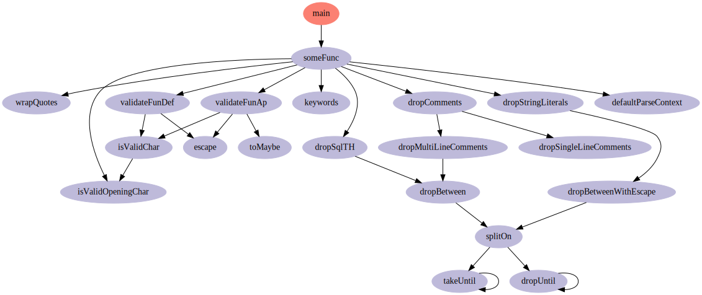

# function-call-graph
This repository generates function call dependency graphs of Haskell files. It is useful for viewing the structure of large libraries, and visualizing the dependencies between subsets of project files.

## Build steps
```sh
stack build
stack install
```

## Usage

The compiled binary is called `fcall`.

`fcall` accepts an arbitrary number of filenames as input arguments, including wildcards. Each file is parsed using Haskell's syntax for function declaration and application. In particular, top-level function definitions occur immediately after a newline character.

### Example `function-call-graph` usage
```sh
fcall */*.hs | dot -Tsvg -o ~/fcall.svg
```



## Current limitations
* Infix operators are not supported.
* Unicode is not supported.
* Since this is a very naive parser, some preprocessor directives and text inside quasiquoters get parsed as functions.
* There's no option to read files or apply a wildcard recursively.
